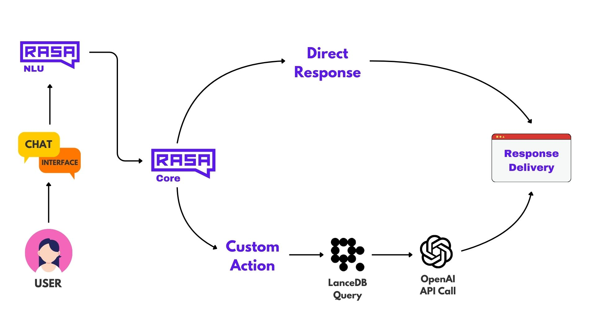

 <a href="https://colab.research.google.com/github/lancedb/vectordb-recipes/blob/main/examples/RASA_Customer-support-bot/main.ipynb"></a>

# Advanced Customer Support Chatbot

Welcome to the **Advanced Customer Support Chatbot** project! This chatbot leverages the powerful combination of **Rasa**, **LanceDB**, and **OpenAI’s LLMs** to deliver intelligent, context-aware, and efficient customer support solutions.

## Overview


**Rasa** is an open-source framework for building sophisticated conversational agents and chatbots. It provides essential tools for natural language understanding (NLU) and dialogue management, enabling developers to create intelligent and contextually aware chatbots tailored to specific business needs. Rasa’s flexibility allows seamless integration with various APIs, databases, and machine learning models, making it an ideal choice for developing robust customer support systems.

## Installation

For detailed installation instructions, please refer to our comprehensive guide available in the Google Colaboratory notebook:

 <a href="https://colab.research.google.com/github/lancedb/vectordb-recipes/blob/main/examples/RASA_Customer-support-bot/main.ipynb"></a>


This guide will walk you through setting up each component of the Super Agent, ensuring a seamless integration process.

## Building the Customer Support Bot

### Initialize the Rasa Project

```python
rasa init --no-prompt
```
This command sets up the basic directory structure with sample data.

### Utilizing LanceDB for Storage of customer support data

- LanceDB serves as the knowledge base for the chatbot, storing FAQs and support information. This setup ensures that the knowledge base is populated with relevant support information, allowing the chatbot to retrieve accurate responses based on user queries.

### Integrating RASA, LanceDB and Openai api in *actions.py*

- **Implement Custom Actions**: Custom actions enable the chatbot to perform specific tasks, such as querying LanceDB and generating responses using OpenAI’s LLM. The actions.py file is the central location for defining these actions.

## Implementation Steps

The RASA customer support bot involves several key steps:

1. **Define knowledge_data and store it in LanceDB**
2. **Configure Rasa Files**
3. **Implement Custom Actions (actions.py)**
4. **Train the Model (rasa train)**
5. **Run Servers**
6. **Deploy and Test**

## Resources

- **Google Colab**: For hands-on examples and detailed code snippets for implementing the Super Agent, visit our [Google Colab Notebook](https://colab.research.google.com/github/lancedb/vectordb-recipes/blob/main/examples/RASA_Customer-support-bot/main.ipynb).

- **Blog Post**: For a more in-depth exploration of the concepts and methodologies discussed in this project, please visit our [Blog Post](https://blog.lancedb.com/customer-support-bot-rasa-x-lancedb/).

