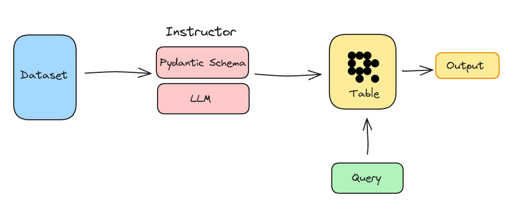

# Create a structured dataset using the Instructor
Structured data is still crucial when working with Structured datasets to ensure high data quality, easy management, and meaningful analysis. Using LLMs to extract structured data automates and improves this process, making it faster and scalable for different fields.

Pydantic, the backbone of [Instructor](https://github.com/jxnl/instructor/), enables high customization and utilizes return datatype hints for seamless schema validation. It seamlessly integrates with LanceDB and directly inserts data into tables.



## Run Code

### Set Env variable
Add `OPENAI_API_KEY` as env variable

```bash
export OPENAI_API_KEY=sk-...
```

Once you have added key as env variable, You are ready to run following code.
```bash
python3 main.py
```
**NOTE**: For this example, we are using [**medium article dataset**](https://huggingface.co/datasets/fabiochiu/medium-articles), check `main.py` for changing dataset or entities to be extracted in schemas mentioned.

Once you have created this dataset, You are ready to do [NER-powered semantic search](https://blog.lancedb.com/ner-powered-semantic-search-using-lancedb-51051dc3e493/) 
